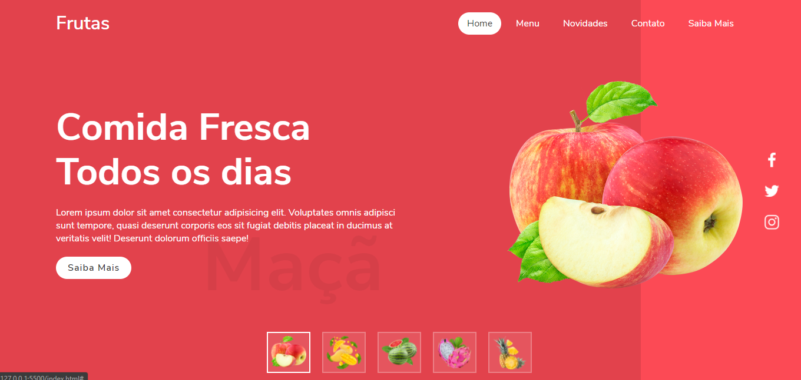

<h1 align="center">
  imgSlider 🍓 (Frutas)
</h1>

<h4 align="center">
  Projeto inspirado em tutorial de HTML + CSS + JS
</h4>

   

## PREVIEW:

  

## DESCRIÇÃO:

  Landing page responsiva com transição de imagems e cor de background.

  

---
Made with ♥ by [Diego Henrique](https:www.linkedin.com/in/diego-henrique-sg) 👋
